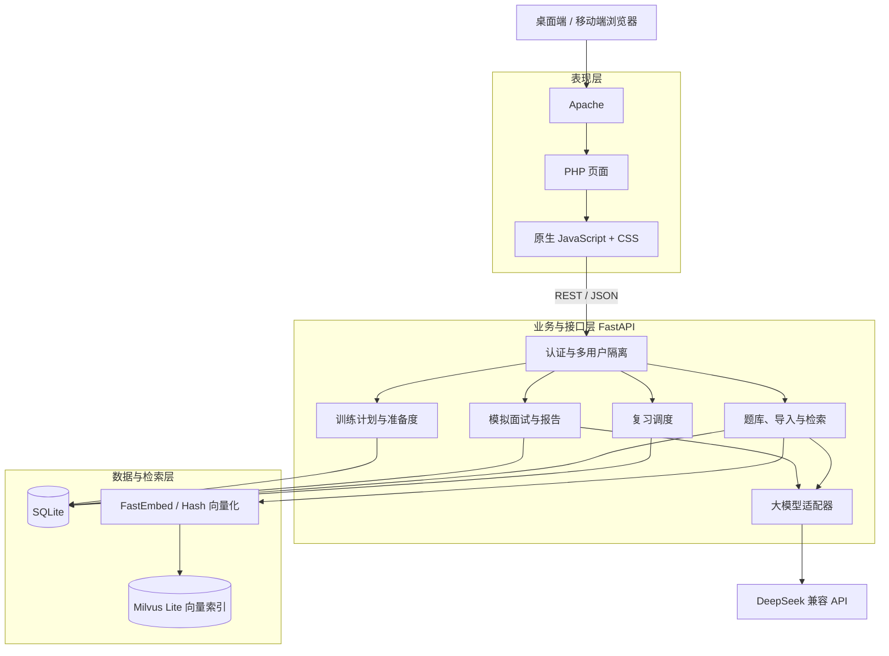
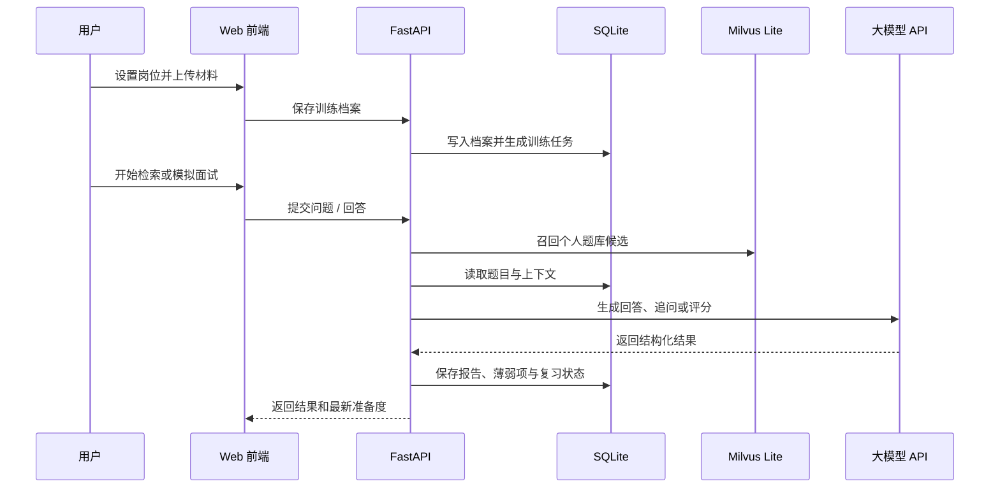

# 鉴微：面试训练与知识库系统

鉴微是一套面向个人求职者和小型团队的面试准备系统。它把岗位目标、JD、简历、项目材料、题库检索、模拟面试、复习计划和训练报告串成一个可持续迭代的训练闭环，并针对轻量服务器提供 Docker Compose 部署方案。

当前版本：`v4.0.0`

## 页面截图


登录后默认进入“训练工作台”，可查看面试准备度、7 天计划、今日任务、薄弱项和历史成绩趋势。

## 核心能力

- **训练工作台**：配置目标岗位、面试日期、经验阶段和每日训练时长，自动生成 7 天训练计划。
- **材料驱动训练**：支持上传 PDF、Word、Markdown、TXT、JSON 和 CSV，提取 JD、简历与项目材料内容。
- **准备度评估**：综合资料完整度、训练完成度、模拟面试成绩和复习情况，展示准备度与分项得分。
- **智能问答**：从个人题库检索相关内容，再结合可选的大模型生成有依据的回答。
- **混合检索**：支持语义检索、关键词检索和可调权重的混合检索。
- **通用模拟面试**：从指定题库抽题、追问、评分并生成报告，低分题自动加入复习计划。
- **项目深挖面试**：自动带入项目材料，围绕技术选型、个人贡献、难点和结果继续追问。
- **间隔复习**：根据作答结果维护复习队列；完成到期复习后同步更新训练任务。
- **题库管理**：支持多题库、题目编辑、标签筛选和批量导入。
- **多用户隔离**：题库、训练档案、面试记录和复习数据按用户隔离，并提供管理员能力。

## 业务闭环


## 整体架构



### 模块职责

| 层级 | 主要技术 | 职责 |
| --- | --- | --- |
| 表现层 | PHP、Apache、JavaScript、CSS | 页面渲染、交互状态、Markdown 展示和 API 代理 |
| 接口层 | FastAPI、Pydantic | 认证、参数校验、业务接口和健康检查 |
| 训练域 | Coach、Interview、Review | 训练计划、准备度、模拟面试、报告和间隔复习 |
| 知识库域 | Question、Import、Search | 题库管理、材料导入、关键词/语义混合检索 |
| 数据层 | SQLite | 用户、题库、训练档案、任务、面试与复习记录 |
| 向量层 | FastEmbed、Milvus Lite | 中文文本向量化、候选召回和用户级过滤 |
| AI 层 | OpenAI 兼容接口 | 回答生成、面试追问、评分和自动标签 |

## 关键数据流



## 目录结构

```text
interview-rag/
|-- backend/
|   |-- app/main.py           # FastAPI 接口与核心业务
|   |-- tests/test_coach.py   # 训练闭环回归测试
|   |-- requirements.txt
|   `-- Dockerfile
|-- frontend/
|   |-- public/
|   |   |-- index.php
|   |   `-- assets/
|   |       |-- app.js
|   |       `-- app.css
|   |-- apache.conf
|   `-- Dockerfile
|-- docs/screenshots/         # README 页面截图
|-- data/                     # 运行数据，不应提交真实内容
|-- docker-compose.yml
|-- .env.example
`-- README.md
```

## 快速启动

环境要求：Docker Engine 和 Docker Compose v2。

```bash
cp .env.example .env
docker compose up -d --build
```

打开 `http://127.0.0.1/`，并检查服务：

```bash
docker compose ps
curl http://127.0.0.1/health
```

健康接口返回的 `version` 应为 `4.0.0`。

## 环境变量

```env
ADMIN_USER=admin
ADMIN_PASSWORD=change-me
DEEPSEEK_API_KEY=
DEEPSEEK_MODEL=deepseek-v4-pro
DEEPSEEK_BASE_URL=https://api.deepseek.com
EMBEDDING_BACKEND=hash
REBUILD_VECTOR_INDEX=0
```

- 小内存环境可使用 `EMBEDDING_BACKEND=hash`，不需要下载模型。
- 中文检索效果优先时可使用 `EMBEDDING_BACKEND=fastembed`。
- 仅在明确需要重建向量索引时设置 `REBUILD_VECTOR_INDEX=1`。
- `.env`、真实数据库、题库、日志和 API Key 不应提交到 GitHub。

## 生产部署

建议先备份源码和 SQLite，再执行更新：

```bash
cd /opt/interview-rag
cp data/app.db "data/app.db.backup-$(date +%Y%m%d-%H%M%S)"
docker compose up -d --build
docker compose ps
curl http://127.0.0.1/health
```

数据库初始化采用追加式迁移：`v4.0.0` 会新增训练档案、训练任务和面试报告字段，不会主动清空已有用户、题库、向量索引或面试记录。

## 测试

```bash
cd backend
pytest -q
python -m compileall -q app
```

前端 PHP 语法检查：

```bash
php -l frontend/public/index.php
```

## v4.0.0 更新摘要

- 默认首页升级为训练工作台。
- 新增求职目标、材料管理和自动 7 天计划。
- 新增准备度、分项得分、薄弱项和成绩趋势。
- 项目材料可直接进入项目深挖面试。
- 低分题、复习计划、训练任务和面试报告实现状态联动。
- 新增训练闭环回归测试，并保持对已有业务数据的兼容。

## 安全说明

- 首次部署后立即修改默认管理员密码。
- 生产环境建议启用 HTTPS，并限制服务器管理端口来源。
- 发布代码前检查 `.gitignore`，不要提交 `.env`、`data/`、备份文件或真实用户材料。
- 对外分享截图前，隐藏用户名、题库内容、简历、JD、项目材料和面试记录。
