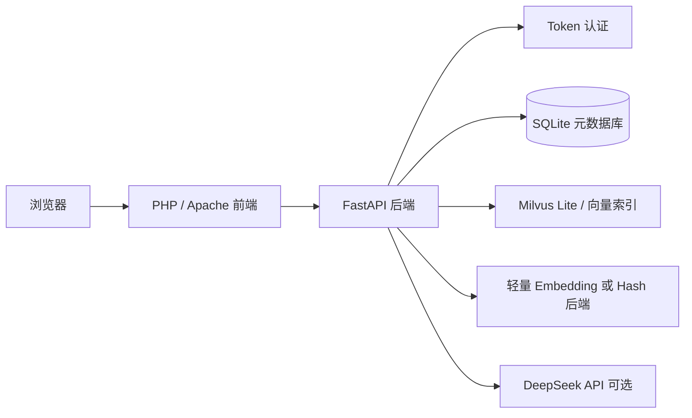
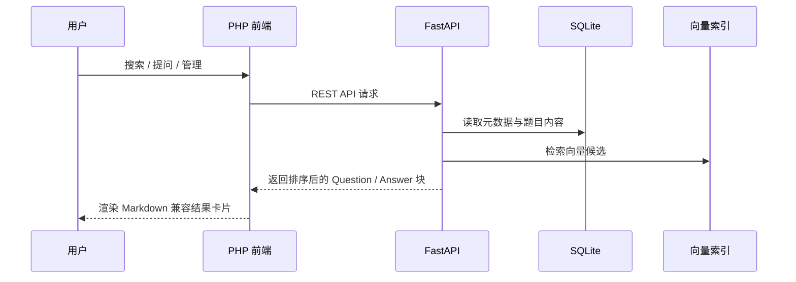

# 鉴微 · 面试 RAG

鉴微（Jianwei）是一个轻量级面试题库、检索、模拟面试与复习系统。采用 PHP/Apache 前端 + FastAPI 后端 + SQLite 元数据存储 + 轻量向量检索层，专为小服务器和 Docker Compose 部署设计。

## 当前版本

`v1.8.0`

v1.8 是本轮部署的最终打磨版本：

- 侧边栏搜索框简化为纯文本输入。
- 放大题目管理页的搜索框，支持长关键词和答案片段搜索。
- 保留 v1.7 引入的分组侧边栏导航。
- 检索、复习、管理页面统一使用 Question / Answer 卡片样式。
- 题目与答案内容兼容 Markdown 显示。
- 新增 GitHub 适配的 README 与安全的 `.gitignore`。

## 功能特性

- **智能问答**：从题库中检索 Top 3 来源，返回有据可依的回答。
- **自定义检索**：支持语义检索、关键词检索、混合检索，可调节权重。
- **模拟面试**：从指定题库随机抽取 6 道题，评估回答并追问。
- **复习计划**：基于已作答的模拟面试题目生成复习队列。
- **题库管理**：创建和管理多个题库空间。
- **题目管理**：支持按题目、答案、标签搜索；题目和答案可分开编辑。
- **多格式导入**：支持 JSON、CSV、Markdown、TXT 格式导入。
- **Markdown 展示**：题目和答案内容支持 Markdown 编写与渲染。

## 系统架构



## 运行时流程



## 目录结构

```text
interview-rag/
├── backend/
│   ├── Dockerfile
│   ├── requirements.txt
│   └── app/main.py
├── frontend/
│   ├── Dockerfile
│   ├── apache.conf
│   └── public/
│       ├── index.php
│       └── assets/
│           ├── app.css
│           └── app.js
├── data/                 # 运行时数据，勿提交真实数据
├── docker-compose.yml
├── .env.example
├── .gitignore
└── README.md
```

## 快速开始

```bash
cp .env.example .env
docker compose up -d --build
```

访问：

```text
http://127.0.0.1/
```

健康检查：

```bash
curl http://127.0.0.1/health
```

## 环境变量

```env
ADMIN_USER=admin
ADMIN_PASSWORD=change-me
DEEPSEEK_API_KEY=
DEEPSEEK_MODEL=deepseek-v4-pro
EMBEDDING_BACKEND=hash
```

说明：

- `EMBEDDING_BACKEND=hash` 适合 4 核 4GB 的小型服务器，资源占用低。
- 如果内存充裕，后续可启用更强的中文 Embedding 模型。
- `.env` 文件务必保密，切勿提交真实 API Key。

## Docker 部署

```bash
cd /opt/interview-rag
docker compose up -d --build
```

检查服务状态：

```bash
docker compose ps
curl http://127.0.0.1/health
```

## 开源发布检查清单

发布到 GitHub 之前：

- 不要提交 `.env`、`data/`、数据库文件、日志或真实题库数据。
- 保留 `.env.example` 作为公开的配置模板。
- UI 稳定后添加截图。
- 添加 `LICENSE` 文件，如 MIT 或 Apache-2.0。
- 添加脱敏后的示例数据，方便用户快速体验系统。
- 考虑使用 GitHub Actions 进行 Docker 镜像构建检查。

## 发布打包

```bash
cd /opt
tar --exclude='interview-rag/data' --exclude='interview-rag/.env' -czf /root/jianwei-v1.8-final.tar.gz interview-rag
```

## 路线图

- GitHub Actions 构建与 Lint 工作流。
- 基于角色的用户管理。
- 完整 Markdown 渲染器，支持表格和任务列表。
- 导入预览与失败行导出。
- 可选的外部向量数据库后端。
- 更灵活可配的 Embedding 与 LLM 提供商。
