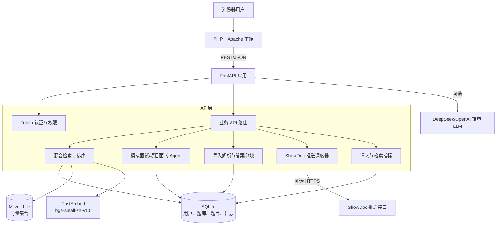

# 鉴微 · 面试 RAG

鉴微是一个面向面试准备的题库、检索、模拟面试与复习系统。项目采用 PHP/Apache 前端、FastAPI 后端、SQLite 元数据存储和 Milvus Lite 向量检索，适合使用 Docker Compose 部署在小型云服务器上。

当前版本：`v3.0.0`

## 功能特性

- **智能问答**：从题库召回相关内容，生成有依据的回答。
- **混合检索**：支持语义检索、关键词检索和可调权重的混合检索。
- **题库管理**：创建多个题库空间，按用户隔离数据和权限。
- **多格式导入**：支持 JSON、CSV、Markdown、TXT，并提供导入预览、分块和失败提示。
- **模拟面试**：随机抽题、回答评估、追问和面试报告。
- **项目面试**：从项目材料中提炼事实、贡献、架构决策、事故和风险等信息，生成结构化面试流程。
- **复习计划**：根据作答记录生成复习队列，支持间隔复习。
- **AI 配置**：支持管理员或用户配置 OpenAI 兼容接口（例如 DeepSeek）。
- **ShowDoc 推送**：支持手动或定时推送题目到 ShowDoc（可选）。
- **管理指标**：记录请求、搜索和检索质量指标，提供管理员统计接口。
- **Markdown 展示**：题目、答案和项目材料支持 Markdown。

## 整体架构



### 组件职责

| 组件 | 技术 | 职责 |
| --- | --- | --- |
| Web | PHP 8.3、Apache | 页面渲染、静态资源、反向代理和浏览器交互 |
| API | Python、FastAPI、Uvicorn | 认证、题库管理、检索、面试、导入和推送接口 |
| 元数据层 | SQLite | 用户、权限、题库、题目、面试记录、复习记录和指标 |
| 向量层 | Milvus Lite | 保存题目/答案向量并执行相似度检索 |
| Embedding | FastEmbed `BAAI/bge-small-zh-v1.5` | 将问题和答案转换为向量，也可切换为低资源 hash 模式 |
| LLM | DeepSeek 或其他 OpenAI 兼容服务 | 生成问答、评估回答和项目面试追问 |
| 持久化 | Docker bind mount + named volume | `data/` 保存业务数据，`model-cache` 保存模型缓存 |

### 一次检索请求的链路

1. 浏览器通过 PHP 页面发起请求，Apache 将 `/api/*` 转发到 FastAPI。
2. FastAPI 校验 Token 和用户所属题库范围。
3. 系统并行计算关键词匹配和向量相似度，从 Milvus Lite 召回候选。
4. 按语义分数、关键词分数、标签和题库权限进行重排，返回 Question/Answer 结果块。
5. `/api/ask` 在有 API Key 时将召回上下文发送给 LLM；没有 Key 时仍可使用检索功能。
6. 中间件记录请求耗时、状态码、用户和检索指标，供管理员统计。

### 数据与索引

- SQLite 文件：`data/app.db`。
- Milvus Lite 文件：`data/milvus.db`。
- 向量集合名称按 Embedding 后端和模型生成，例如 `interview_qa_fastembed_baai_bge_small_zh_v1_5_parent_child_user_v3`。
- 答案按重叠窗口分块，父题目与子分块同时保存，检索命中后再合并展示。
- 设置 `REBUILD_VECTOR_INDEX=1` 可在启动时重建当前向量集合；生产环境默认保持 `0`。

## 目录结构

```text
interview-rag/
├── backend/
│   ├── Dockerfile
│   ├── requirements.txt
│   └── app/main.py          # FastAPI 应用与业务路由
├── frontend/
│   ├── Dockerfile
│   ├── apache.conf          # Apache 到 API 的反向代理
│   └── public/
│       ├── index.php
│       └── assets/
│           ├── app.css
│           └── app.js
├── data/                    # 运行时数据，不提交真实数据
├── docker-compose.yml
├── .env.example
└── README.md
```

## 快速开始

要求：Docker Engine 24+ 和 Docker Compose v2。

```bash
cp .env.example .env
# 编辑 .env，至少修改 ADMIN_PASSWORD
docker compose up -d --build
```

访问：<http://127.0.0.1/>

```bash
curl http://127.0.0.1/health
docker compose ps
```

## 环境变量

```env
ADMIN_USER=admin
ADMIN_PASSWORD=change-me
DEEPSEEK_API_KEY=
DEEPSEEK_MODEL=deepseek-v4-pro
DEEPSEEK_BASE_URL=https://api.deepseek.com
EMBEDDING_BACKEND=fastembed
REBUILD_VECTOR_INDEX=0
```

- `fastembed` 使用中文向量模型，适合正式检索；首次启动需要准备模型缓存。
- `hash` 不下载模型，资源占用更低，但语义检索效果较弱。
- `DEEPSEEK_API_KEY` 为空时，检索和题库功能仍可用，依赖 LLM 的生成能力不可用。
- `.env`、真实 API Key、`data/` 和数据库文件已被 `.gitignore` 排除，禁止提交到 GitHub。

## 生产部署

```bash
cd /opt/interview-rag
docker compose up -d --build
docker compose ps
curl http://127.0.0.1/health
```

生产环境建议：

- 使用强密码并限制 80 端口的来源，必要时在前置 Nginx/Caddy 配置 HTTPS。
- 定期备份 `data/app.db`、`data/milvus.db` 和 `.env`。
- 保留 `model-cache` volume，避免每次重启重新下载模型。
- ShowDoc 推送地址通过服务器专用 Compose override 或用户设置注入，不要写入仓库。

## 从 GitHub 更新

```bash
cd /opt/interview-rag
git pull --ff-only origin main
docker compose up -d --build
docker compose ps
```

更新前建议备份：

```bash
tar --exclude='interview-rag/data' --exclude='interview-rag/.env' \
  -czf /root/interview-rag-backup-$(date +%Y%m%d-%H%M%S).tar.gz /opt/interview-rag
```

## 开源发布检查

- 不提交 `.env`、数据库、日志、真实题库和 ShowDoc 推送地址。
- 保留 `.env.example` 作为配置模板。
- 发布前执行 `python -m py_compile backend/app/main.py` 和 `docker compose config --quiet`。
- 建议在 GitHub Actions 中执行 Docker 构建和基础接口测试。

## 许可证

当前仓库尚未指定许可证。公开分发前请补充合适的 LICENSE 文件。
