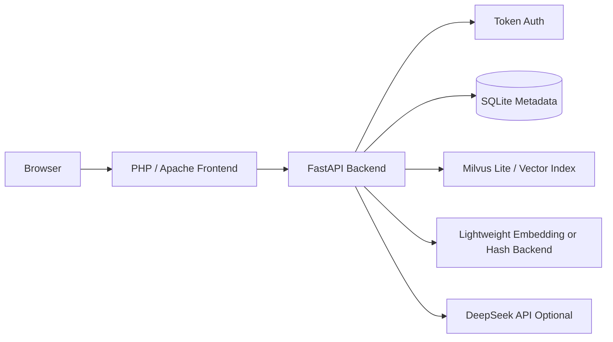
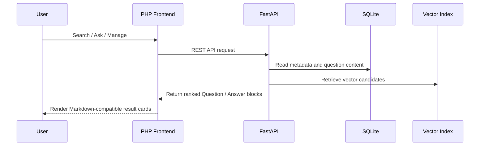

# Jianwei Interview RAG

Jianwei (??) is a lightweight interview question bank, retrieval, mock interview, and review system. It uses a PHP/Apache frontend, FastAPI backend, SQLite metadata storage, and a lightweight vector retrieval layer. The project is designed for small servers and Docker Compose deployment.

## Status

Current version: `v2.4.0`

v1.8 is the final polishing release for this deployment:

- Simplifies the sidebar search box to plain text input only.
- Enlarges the Question Management search field for long keywords and answer snippets.
- Keeps the grouped sidebar navigation introduced in v1.7.
- Keeps consistent Question / Answer cards across retrieval, review, and management pages.
- Keeps Markdown-compatible display for questions and answers.
- Adds this GitHub-ready README and a safe `.gitignore`.

## Features

- Smart Q&A: retrieves Top 3 sources from the question bank and returns a grounded answer.
- Custom Retrieval: semantic, keyword, and hybrid search with adjustable weights.
- Mock Interview: randomly selects 6 questions from a chosen bank, evaluates answers, and asks follow-up questions.
- Review Plan: review queue based on answered mock interview questions.
- Question Banks: create and manage multiple bank spaces.
- Question Management: search by question, answer, and tags; edit question and answer separately.
- Multi-format Import: JSON, CSV, Markdown, and TXT.
- Markdown Display: question and answer content can be written and displayed in Markdown.

## Architecture



## Runtime Flow



## Directory Structure

```text
interview-rag/
??? backend/
?   ??? Dockerfile
?   ??? requirements.txt
?   ??? app/main.py
??? frontend/
?   ??? Dockerfile
?   ??? apache.conf
?   ??? public/
?       ??? index.php
?       ??? assets/
?           ??? app.css
?           ??? app.js
??? data/                 # runtime data, do not publish real data
??? docker-compose.yml
??? .env.example
??? .gitignore
??? README.md
```

## Quick Start

```bash
cp .env.example .env
docker compose up -d --build
```

Open:

```text
http://127.0.0.1/
```

Health check:

```bash
curl http://127.0.0.1/health
```

## Environment Variables

```env
ADMIN_USER=admin
ADMIN_PASSWORD=change-me
DEEPSEEK_API_KEY=
DEEPSEEK_MODEL=deepseek-v4-pro
EMBEDDING_BACKEND=hash
```

Notes:

- `EMBEDDING_BACKEND=hash` is resource-friendly for 4-core 4GB servers.
- A stronger Chinese embedding model can be enabled later if more memory is available.
- Keep `.env` private and never commit real API keys.

## Docker Deployment

```bash
cd /opt/interview-rag
docker compose up -d --build
```

Check services:

```bash
docker compose ps
curl http://127.0.0.1/health
```

## Open Source Checklist

Before publishing to GitHub:

- Do not commit `.env`, `data/`, database files, logs, or real question banks.
- Keep `.env.example` as the public configuration template.
- Add screenshots after UI stabilization.
- Add a `LICENSE` file, such as MIT or Apache-2.0.
- Add sanitized sample data if you want users to try the system quickly.
- Consider GitHub Actions for Docker image build checks.

## Release Package

```bash
cd /opt
tar --exclude='interview-rag/data' --exclude='interview-rag/.env' -czf /root/jianwei-v1.8-final.tar.gz interview-rag
```

## Roadmap

- GitHub Actions build and lint workflow.
- Role-based user management.
- Full Markdown renderer with tables and task lists.
- Import preview and failed-row export.
- Optional external vector database backend.
- More configurable embedding and LLM providers.


## v2.0 Import UI

v2.0 focuses on the batch import page experience:

- Larger upload card with selected file name and file size.
- Clear upload progress bar and success/error status block.
- Side-by-side Markdown question-bank partition guide.
- Reset button for clearing selected file, progress and result.
- Server package path: `/root/jianwei-v2.0-final.tar.gz`.


## v2.1 Tailwind UI

v2.1 modernizes the PHP frontend with Tailwind CDN while preserving existing PHP routing, form IDs, JavaScript hooks and API behavior.

- Notion/Vercel-inspired neutral UI language.
- Tailwind CDN included directly in `frontend/public/index.php`.
- Existing backend and API logic preserved.
- Server package path: `/root/jianwei-v2.1-final.tar.gz`.


## v2.2 Sidebar Refresh

v2.2 sharpens the left navigation into a calmer SaaS-style shell, with stronger hierarchy, softer surfaces, and a more premium information density.


## v2.3 AdminLTE Refresh

This release refreshes the shell toward an AdminLTE-inspired console: stronger left navigation hierarchy, calmer surfaces, and more polished spacing.


## v2.4 Lite Shell

Simplifies the AdminLTE-inspired UI by removing repeated sidebar promotional blocks and reducing the top title bar to a cleaner title/status layout.
